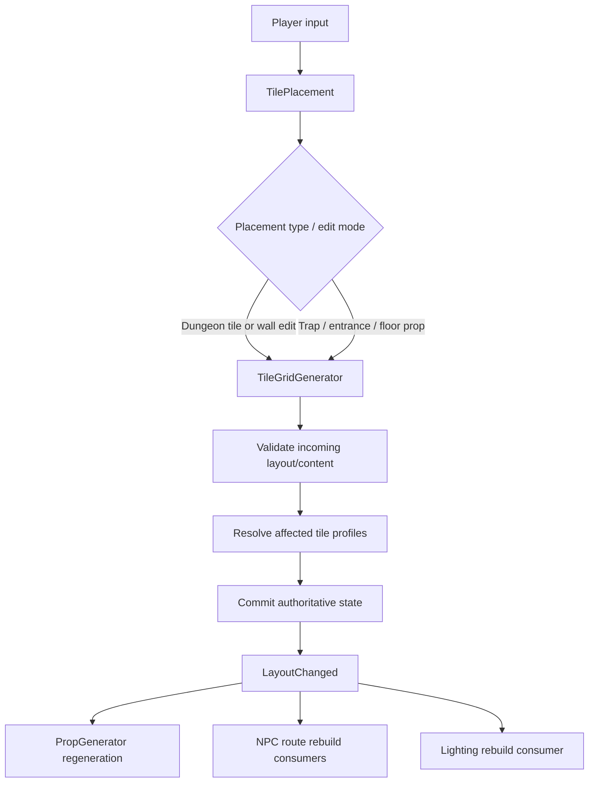

# Dungeon Generation and Building Architecture

## Purpose

This page describes the current implementation boundary for player-driven dungeon construction. For desired behavior and future direction, read [`../Design/World_Generation_and_Building.md`](../Design/World_Generation_and_Building.md).

## Primary scripts

- `TilePlacement` — player-facing placement coordinator and editing modes.
- `TileGridGenerator` — authoritative built-cell state, placement validation, local tile resolution, and content ownership.
- `TileAdjacencyDatabase` — tile/profile compatibility data used during resolution.
- `TileSocketProfile` — one rotated tile profile, including category, edge hashes/matches, source prefab, and baked prop sockets.
- `ObjectsDatabaseSO` — build-palette object definitions and placement type.
- `PropGenerator` — derived procedural structures/props created from the resolved dungeon.

## Runtime flow

## Authoritative versus derived state

Treat these as conceptually separate:

**Authoritative**
- which cells are built;
- width intent (`Auto`, `Narrow`, `Wide`);
- shared-edge connection intent (`Auto`, `Open`, `Closed`);
- placed gameplay content such as traps, floor props, and the dungeon entrance.

**Resolved / derived**
- the concrete tile prefab/profile selected for a cell;
- generated structures and decorative/procedural props;
- NPC route graph;
- lighting field.

This distinction is important when implementing regeneration, save/load, or replacement behavior. Do not persist a derived object as the only record of player intent.

## Tile profile model

`TileSocketProfile` stores:

- `sourcePrefab`;
- rotation in 90-degree steps;
- base tile name and `TileCategory`;
- north/south/east/west edge hashes;
- compatibility match lists;
- baked prop sockets;
- compatible trap attachment surfaces (an unauthored legacy mask currently
  permits all surfaces).

Profiles are therefore both visual candidates and authored compatibility records. A new tile prefab generally needs its profile data baked/registered before the solver can use it.

## Placement validation

`TileGridGenerator` exposes a placement-validation context so candidate changes can be checked against an incoming layout without partially mutating the live dungeon. Feature-specific content should prefer narrow compatibility hooks rather than adding every special rule directly to the grid.

Examples:
- `FloorProp.IsCompatibleWith(...)` provides a content-local compatibility hook.
- trap target and external service-space reservations are considered during
  validation so mechanisms do not overlap content or each other.

When adding a new placeable type, ask whether it can fit an existing category (`Trap`, `Entrance`, `FloorProp`) before expanding the grid's core placement taxonomy.

## Local resolution rule

Edits should re-resolve the smallest affected neighborhood that can restore a valid profile solution. Avoid feature code that globally rebuilds or replaces distant cells for a local edit unless the solver genuinely requires it.

## Events and downstream systems

A successful layout mutation can affect:

- `PropGenerator` — procedural structures may be rebuilt or discarded.
- `NPCTraversal` — route graph depends on resolved openings and generated traversal structures.
- `DungeonLightingManager` — listens to `LayoutChanged` and rebuilds lighting.
- `GameSaveManager` — must be able to capture the new authoritative state.

## Safe extension points

Prefer these, in order:

1. data/profile additions when behavior already exists;
2. leaf component compatibility hooks (`FloorProp`, trap subclass, POI component);
3. `TilePlacement` for a new player editing interaction that maps cleanly to existing grid operations;
4. `TileGridGenerator` only when the authoritative topology/validation model itself must change.

## High-risk changes

Changes to these concepts have broad blast radius:

- cell coordinate model;
- connection intent representation;
- profile/socket compatibility semantics;
- placement transaction/rollback behavior;
- when `LayoutChanged` fires;
- destruction/recreation rules for placed content.

For these changes, inspect save/load, NPC traversal, props, and lighting in the same ticket.

## Related guides

- [`../HowTo/Add_A_Dungeon_Tile.md`](../HowTo/Add_A_Dungeon_Tile.md)
- [`../HowTo/Add_A_Trap.md`](../HowTo/Add_A_Trap.md)
- [`../HowTo/Add_A_Floor_Prop.md`](../HowTo/Add_A_Floor_Prop.md)
- [`Props_and_Traps.md`](Props_and_Traps.md)
- [`Save_System.md`](Save_System.md)
