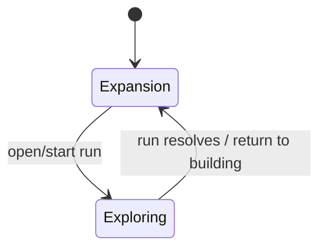

# Gameplay Loop Architecture

> **Implementation versus target:** This page describes the existing implementation. The [raid-building pivot](../Design/Core_Game_Direction.md) lifecycle ownership is now established, while playable Warrior attempts, world resets, objective validation, persistent immutable publishing, and resource receipts remain tracked in the [raid roadmap](../Roadmap/Core-Gameplay-Loop.md).

## Purpose

`GameplayLoopController` is the high-level owner of the prototype dungeon loop. It coordinates phase state, simulation speed, dungeon progression, Dread, adventurer spawning/lifecycle, and persistent scenario state.

## Primary collaborators

- `TilePlacement` — building input is enabled/disabled based on phase.
- `TileGridGenerator` — current dungeon state and placement context.
- `NPCTraversal` — adventurer exploration runtime.
- `GameplayLoopUI` — presentation and player controls.
- `GameSaveManager` — persistence coordinator.

## Phase model

The legacy management loop retains these phases:

- `Expansion` — player building/editing state.
- `Exploring` — adventurer simulation state.

The phase boundary matters because multiple systems assume the dungeon topology is stable while an adventurer run is active.

The raid prototype lifecycle is coordinated by `GameplayLoopController` through
the separate `DungeonLifecycle` model:

- the working dungeon owns a monotonically increasing authoring revision;
- creator validation proof is bound to one exact revision and gameplay
  compatibility identity;
- published versions retain immutable authored snapshot data and continue to
  exist when later working-copy edits invalidate proof;
- creator-validation and raid attempts own distinct IDs and runtime states:
  seeking treasure, carrying treasure, escaped, dead, or abandoned.

These are independent owners rather than additional values in `DungeonPhase`.
Accepted grid, trap, prop, entrance, obstacle, edge, and material edits increment
the working revision. Failed edits do not. Multi-step save and scenario restores
batch their successful internal mutations into one revision. Validation and raid
attempts disable build entry points, save/scenario loading, and debug controls.
Attempt callbacks require the current attempt ID, preventing a restarted or
abandoned runtime instance from completing the replacement attempt.

`WarriorPlayerController` observes this lifecycle but does not own it. It forwards
input to `RaiderAbilities` only while the current attempt is active. Character
death requests `TryDieInAttempt` once for that attempt; restart remains a
`GameplayLoopController` transition, after which the controller calls
`RaiderAbilities.ResetForAttempt`. Future objective owners can use the same
`StateChanged` transition rather than placing objective reset logic in the input
controller.

`DungeonLifecycle` currently stores snapshot payloads in session memory. The
authored snapshot serializer, immutable local persistence, compatibility
fingerprint construction, and fresh runtime-world restoration are owned by the
later publishing, persistence, and raid tickets.

## Owned persistent state

The gameplay loop currently owns or coordinates persistent scenario concepts including:

- dungeon open count;
- Dread;
- dungeon level;
- selected simulation speed;
- adventurer roster;
- Dread harvest/spend history;
- expedition outcomes;
- recovered loot and recovery history.

When introducing a new progression variable, decide whether it belongs here, on a content object, or in a dedicated subsystem. Do not use `GameplayLoopController` as a generic global state bucket.

## Simulation-time boundary

Gameplay systems that need pausing/speed scaling should prefer the existing `DungeonSimulationState` abstraction rather than directly using `Time.deltaTime` when the behavior is meant to follow dungeon simulation speed.

## Extension guidance

Good candidates for feature-local scripts:

- a new adventurer stat or behavior: `NPCCharacter` / NPC action layer;
- a new trap effect: trap subclass / `NPCActionResolver`;
- a new persistent economy: dedicated model/controller that the gameplay loop coordinates;
- UI-only presentation: `GameplayLoopUI` or a focused UI component.

Edit `GameplayLoopController` when the feature changes the phase lifecycle, progression ownership, or the contract between building and exploration.

## Cross-system checks

If changing phase transitions or adventurer-run boundaries, verify:

1. building input cannot mutate topology at an unsafe time;
2. NPC traversal starts/stops from a valid route graph;
3. procedural structures are stable while NPCs use them;
4. pause/simulation speed behavior remains consistent;
5. save eligibility still matches the desired safe state.

## Related docs

- [`NPC_Runtime.md`](NPC_Runtime.md)
- [`Save_System.md`](Save_System.md)
- [`../Design/Core_Game_Direction.md`](../Design/Core_Game_Direction.md)
- [`../Design/NPC_Behavior.md`](../Design/NPC_Behavior.md)
