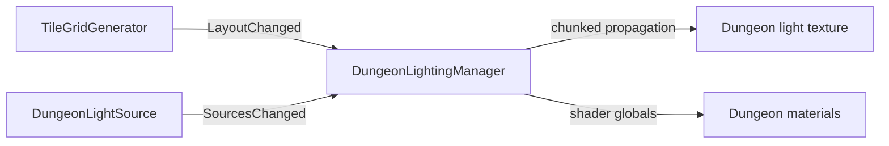

# Dungeon Lighting Architecture

## Purpose

`DungeonLightingManager` maintains a low-resolution world-space light field for dungeon materials. Lighting is a downstream consumer of dungeon topology rather than part of placement ownership.

## Inputs

- `TileGridGenerator` — grid dimensions, placed topology, material application, and `LayoutChanged`.
- `DungeonLightSource` — static/dynamic light sources and `SourcesChanged`.

## Runtime flow

The manager supports legacy cell sampling and smoother sub-cell sampling presets. Dynamic sources refresh on an interval rather than forcing a full per-frame rebuild.

## Ownership rule

Do not add light-state persistence to individual tile placements unless the light is itself authoritative gameplay content. The light field is derived from the current layout and active sources and should be rebuilt when those inputs change.

## When a generation change affects lighting

Check lighting if you change:

- what constitutes an open/closed connection;
- grid dimensions or coordinate mapping;
- material assignment for placed tiles;
- how layout-change events are emitted;
- topology that should block or transmit light.

## Extension guidance

- New lamp/torch content: prefer `DungeonLightSource` configuration/component work.
- New material response: shader / `DungeonLightReceiver` or material-side work.
- New propagation rule: `DungeonLightingManager` architecture work.
- Purely decorative emissive art that does not illuminate the dungeon does not need to enter this system.

## Related docs

- [`Dungeon_Generation.md`](Dungeon_Generation.md)
- [`System_Map.md`](System_Map.md)
- [`../Design/Visual_and_Interaction_Design.md`](../Design/Visual_and_Interaction_Design.md)
