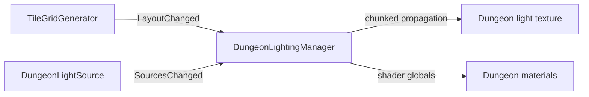

# Dungeon Lighting Architecture

## Purpose

`DungeonLightingManager` maintains a low-resolution world-space light field for dungeon materials. Lighting is a downstream consumer of dungeon topology rather than part of placement ownership.

## Inputs

- `TileGridGenerator` — grid dimensions, placed topology, material application, and `LayoutChanged`.
- `DungeonLightSource` — static/dynamic light sources and `SourcesChanged`.

## Runtime flow

The manager supports legacy cell sampling and smoother sub-cell sampling presets. Dynamic sources refresh on an interval rather than forcing a full per-frame rebuild.

`RotationSafeTileAtlas.shader` samples `_DungeonLightTexture` with the manager's
grid-origin, grid-step, and grid-size globals. It adds the propagated ambient and
local RGB contribution to its quantized main-light response, then applies the
separate phase-controlled `_GlobalLightIntensity` presentation multiplier. The
`_DungeonLightingInitialized` global prevents an uninitialized/default texture
from lighting tiles before a manager has established its grid.

The production `Placeholder_NPC` carries a dynamic `DungeonLightSource`, so its
light field contribution follows traversal automatically and refreshes at the
manager's configured dynamic interval.

## Phase presentation modes

`GameplayLoopController` selects the lighting presentation through
`DungeonLightingManager.SetPresentationMode` whenever the dungeon phase changes:

- `ExpansionUniform` uses uniform material illumination. It bypasses both the
  quantized directional-light/shadow response and the propagated dungeon light
  texture so construction remains clearly readable.
- `ExploringAtmospheric` enables the quantized main directional light, its
  realtime shadow attenuation, ambient dungeon darkness, and propagated dynamic
  sources such as NPC lights.

The manager blends `_DungeonLightingModeBlend` between these responses using
unscaled time. The default transition duration is 0.3 seconds, so pausing the
game does not strand the presentation between modes. Disabling or unloading the
manager resets the global to the uniform expansion response.

This blend is independent of `_GlobalLightIntensity`. The presentation mode
chooses which lighting model is visible; `DungeonVisualLightingController`
controls the separate phase-brightness treatment.

The runtime debug lighting override controls both layers. Enabling it uses the
configured debug brightness and forces the uniform presentation response,
bypassing directional quantization, realtime shadows, and propagated dungeon
cell/NPC lighting. Disabling it blends back to the response for the current
gameplay phase.

## Ownership rule

Do not add light-state persistence to individual tile placements unless the light is itself authoritative gameplay content. The light field is derived from the current layout and active sources and should be rebuilt when those inputs change.

## When a generation change affects lighting

Check lighting if you change:

- what constitutes an open/closed connection;
- grid dimensions or coordinate mapping;
- material assignment for placed tiles;
- how layout-change events are emitted;
- topology that should block or transmit light.

## Extension guidance

- New lamp/torch content: prefer `DungeonLightSource` configuration/component work.
- New material response: shader / `DungeonLightReceiver` or material-side work.
- New propagation rule: `DungeonLightingManager` architecture work.
- Purely decorative emissive art that does not illuminate the dungeon does not need to enter this system.

## Related docs

- [`Dungeon_Generation.md`](Dungeon_Generation.md)
- [`System_Map.md`](System_Map.md)
- [`../Design/Visual_and_Interaction_Design.md`](../Design/Visual_and_Interaction_Design.md)
