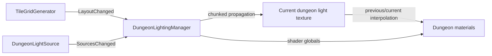

# Dungeon Lighting Architecture

## Purpose

`DungeonLightingManager` maintains a low-resolution world-space light field for dungeon materials. Lighting is a downstream consumer of dungeon topology rather than part of placement ownership.

## Inputs

- `TileGridGenerator` — grid dimensions, placed topology, material application, and `LayoutChanged`.
- `DungeonLightSource` — static/dynamic light sources and `SourcesChanged`.

## Runtime flow



The manager supports legacy cell sampling and smoother sub-cell sampling presets. Dynamic sources refresh on an interval rather than forcing a full per-frame rebuild.

Dynamic presentation uses two shared textures. Before a dynamic propagation
upload, the current target texture is copied to the previous texture. The new
field is uploaded to the current texture, and `_DungeonLightTextureBlend`
advances from 0 to 1 every rendered frame using unscaled time over the configured
dynamic update interval. Full/static rebuilds synchronize both textures
immediately. The default dynamic update interval is 0.05 seconds (20 Hz).

`RotationSafeTileAtlas.shader` samples `_DungeonLightTexture` with the manager's
grid-origin, grid-step, and grid-size globals. Before sampling, it snaps the
world-derived grid coordinate to `_DungeonLightingPixelsPerCell` blocks per
dungeon cell; the default is 2 and the value has no enforced upper limit. Values
2, 4, 8, 16, and 32 progress from coarse to high-detail pixel-light silhouettes.
This grid-space snapping is stable under camera movement and tile rotation and
is independent of the underlying LegacyCell, Smooth2x, or Smooth4x propagation
resolution.

## Stable propagated-field sampling

Lighting sampling uses four explicitly separate coordinate stages:

```text
World position
→ continuous dungeon-grid coordinate
→ snapped visible-light block center
→ exact propagated-field texel center
→ previous/current temporal interpolation
→ HDR presentation
```

`DungeonLightingManager` publishes the active propagation samples per cell (`1`,
`2`, or `4`) independently from visible lighting pixels per cell. After snapping
to the visible block center, the shader converts that logical position into the
actual propagation texture dimensions. It identifies the four surrounding real
propagation texels, reads them by integer texel index without sampler filtering,
and reconstructs RGB with a deterministic bilinear interpolation. Previous and current temporal fields are
reconstructed independently before their RGB values are blended.

The original explicit point reconstruction removed filtering ambiguity but made
visible density appear capped by the `1/2/4` propagation samples per cell.
Deterministic manual bilinear reconstruction restores meaningful visual changes
at densities such as 8, 16, and 32. It uses eight texture reads per fragment
(four previous plus four current integer loads) and does not depend on texture Filter Mode for
the visible-grid result.

Visible density may substantially exceed propagation resolution: Smooth2x or
Smooth4x can drive 16 or 32 visible blocks per cell without changing simulation
resolution. The earlier hatching at high density is treated as a sampling issue,
not mesh z-fighting; no geometry, Z offset, depth bias, render queue, dithering,
or topology workaround is used.

CPU chunk storage uses floating-point `Color` buffers, and the paired GPU fields
use `RGBAHalf` when supported (`RGBAFloat` is the explicit HDR fallback). Source
and overlapping-light values accumulate without a 0-1 ceiling. Platforms
supporting neither HDR format fail lighting initialization rather than silently
falling back to an 8-bit saturated field.

The shader interpolates the previous/current local RGB fields, then combines
that local result with `_DungeonAmbientColor` and converts the total to
non-negative Rec.709 luminance. HDR energy is compressed through
`1 - exp(-energy * _LightExposure)` before quantization with `_LightSteps`. It
remaps the quantized result through `_MinLight` to 1 and multiplies the authored
atlas rather than adding light color to it. Local-only luminance above
`_OverbrightThreshold` is shaped by
`1 - exp(-excess * _OverbrightResponse)` and remapped from 1 to
`_MaxOverbright`; ambient cannot produce this effect. The normalized hot amount
also blends local hue from white through `_OverbrightColorInfluence`, producing
a stronger source-colored core without spreading that treatment across the
ordinary halo. The separate
phase-controlled `_GlobalLightIntensity` presentation multiplier is applied
afterward. The
`_DungeonLightingInitialized` global prevents an uninitialized/default texture
from lighting tiles before a manager has established its grid.

Ambient and local color have separate responsibilities. Ambient contributes to
brightness but not local hue. Local RGB is normalized by its maximum channel,
falling back to white when no local light is present, and blended from white by
the material's `_LightColorInfluence` (default 0.35). Overlapping colored sources
remain accumulated in the propagated RGB field, so their combined field color
produces the tint without a per-source shader loop. Normal illumination,
restrained tint, and bounded overbright remain multiplicative.

Strong local HDR illumination intentionally adds one additional presentation
layer. Original sampled atlas luminance is mapped through
`smoothstep(_HotWashBlackPoint, _HotWashFullPoint, atlasLuminance)`. That mask is
multiplied by the local-only overbright response, normalized local hue,
`_HotWashStrength`, mode blend, global presentation brightness, and vertex AO,
then added to the multiplicatively lit result. Ambient cannot create this wash.
Near-black atlas pixels receive little or no contribution, while midtones and
brighter authored pixels can wash toward the source color. Highlight-protection
controls were not added; the two-point luminance mask is the smallest initial
contract pending visual validation.

```text
Final = Atlas × normal lighting × normal tint × multiplicative overbright
        + local hot response × original-atlas luminance mask × hot color
        + mask-driven local specular
        + mask-driven surface emission
```

The rotation-safe terrain shader optionally samples
`DungeonAtlas_Mask.png` with the exact selected UV already used for base
color. R is emission, G roughness, B metallic, and A is reserved. Emission is
surface appearance only and never registers a `DungeonLightSource` or Unity
Light. Specular is driven by local propagated energy and a shared art-directed
direction because the current RGB light field does not encode per-source
direction. Roughness controls highlight width/attenuation; metallic controls
reflectivity and base-color tint. `_SpecularStylization` blends smooth response
toward independently quantized `_SpecularSteps`, without changing diffuse
`_LightSteps`. Both additions default to zero strength and introduce no normal
map dependency or shader-keyword variants.

## Source controls and animation

`DungeonLightSource` owns source behavior. Its effective contribution is
`CurrentColor × CurrentIntensity × shaped falloff × core boost`.

The base falloff is `pow(1 - saturate(distance / radius), falloffPower)`. Within
the inner radius it is multiplied by
`1 + saturate(1 - distance / innerRadius) * coreBoost`. This is continuous at the
inner-radius boundary and reaches zero at the outer radius.

Current defaults and safe ranges are:

- intensity: `1`, non-negative and HDR-capable;
- radius: `6` cells, minimum `0.25`;
- falloff power: `2`, range `0.1-8`;
- inner radius: `0`, clamped to `0-radius`;
- core boost: `0`, range `0-8`;
- intensity flicker: opt-in, amount `0.12` (`0-1`), speed `2` (`0.01-10`);
- color animation: opt-in, amount `0.25` (`0-1`), speed `1` (`0.01-10`), an
  authorable HDR gradient, and Noise or Loop mode.

Noise animation uses deterministic Perlin samples derived from the source's
integer seed. Intensity and color use different salted coordinates so they do
not move in lockstep. Loop mode is the deliberate predictable gradient option.
Animation uses unscaled presentation time, so cosmetic flicker continues during
selective simulation pause. Animated sources are treated as dynamic; the manager
samples their current state only at its normal dynamic refresh, and temporal
texture interpolation smooths the visible result.

Useful starting points (tuning examples, not hardcoded presets):

- Torch: radius `4-6`, power `2-3`, inner radius `1-1.5`, core boost `2-4`,
  warm HDR color, intensity `1.5-3`, noise flicker amount `0.08-0.18`, and a
  restrained warm gradient.
- Soft ambient source: radius `6-10`, power `0.5-1`, no core boost, low intensity,
  and animation disabled.
- Strong magical source: radius `5-8`, power `1-2`, inner radius `1-2`, core
  boost `1-3`, intensity `2-4`, and an authored blue/violet/cyan gradient using
  Noise or intentional Loop mode.

## HDR memory

For the current 15×15 grid, each `RGBAHalf` texture uses 8 bytes per sample
instead of 4 for `RGBA32`. With paired temporal textures, approximate GPU
storage is 3.6 KB at LegacyCell, 14.4 KB at Smooth2x, and 57.6 KB at Smooth4x
(2× the previous paired-RGBA32 storage). The three CPU chunk arrays use 16-byte
`Color` entries instead of 4-byte `Color32`: approximately 10.8 KB, 43.2 KB, and
172.8 KB respectively (4× previous CPU storage). These figures exclude small
texture/object and managed-array overhead.

The production tile receiver is visually unlit and has no main directional-light
or realtime main-light-shadow dependency. Normal data is used for rotation-safe
surface-role selection only, not diffuse lighting. Dungeon Sim therefore does
not rely on a sun/directional light for normal dungeon rendering.

The production `Placeholder_NPC` carries a dynamic `DungeonLightSource`, so its
light field contribution follows traversal automatically and refreshes at the
manager's configured dynamic interval.

## Phase presentation modes

`GameplayLoopController` selects the lighting presentation through
`DungeonLightingManager.SetPresentationMode` whenever the dungeon phase changes:

- `ExpansionUniform` uses uniform material illumination. It bypasses both the
  quantized dungeon light response and the propagated dungeon light texture so
  construction remains clearly readable.
- `ExploringAtmospheric` enables ambient dungeon darkness and quantized
  propagated static/dynamic sources such as NPC lights.

The manager blends `_DungeonLightingModeBlend` between these responses using
unscaled time. The default transition duration is 0.3 seconds, so pausing the
game does not strand the presentation between modes. Disabling or unloading the
manager resets the global to the uniform expansion response.

This blend is independent of `_GlobalLightIntensity`. The presentation mode
chooses which lighting model is visible; `DungeonVisualLightingController`
controls the separate phase-brightness treatment.

The runtime debug lighting override controls both layers. Enabling it uses the
configured debug brightness and forces the uniform presentation response,
bypassing quantized propagated dungeon cell/NPC lighting. Disabling it blends
back to the response for the current gameplay phase.

Current `DungeonLightSource` illumination is transported through the propagated
light field; it does not use Unity point/spot lights and does not cast realtime
Unity shadows. The shader retains its `ShadowCaster` pass for future
compatibility, but realtime stylized point/spot-light shadow reception requires
a separate implementation.

## Independent tuning controls

- Propagation resolution (`LightQualityPreset`) controls samples calculated per
  dungeon cell.
- Dynamic update interval controls how often moving sources are propagated.
- Visible lighting pixels per cell controls only the world-space block size used
  for shader sampling. It has a minimum of 1 and no upper cap; 2/4/8/16/32 are
  representative validation points.
- Propagation samples per cell is derived from quality (`1/2/4`) and controls
  light-field simulation/storage resolution, not visible pixel density.
- `_LightSteps` controls the number of brightness bands.
- `_LightExposure` maps HDR energy into the normal 0-1 illumination response.
- `_OverbrightThreshold` controls where local HDR hot response begins.
- `_OverbrightResponse` controls how quickly excess energy approaches the cap.
- `_MaxOverbright` sets the brightest permitted local multiplier.
- `_OverbrightColorInfluence` controls source-hue strength in proportion to the
  actual hot response.
- `_LightColorInfluence` controls restrained continuous local hue independently
  from quantized brightness.
- `_HotWashStrength` controls additive high-energy lift/color amount.
- `_HotWashBlackPoint` protects the darkest original atlas pixels.
- `_HotWashFullPoint` sets the atlas luminance receiving the full wash.
- `_HotWashColorInfluence` controls source-hue strength in the additive core.

## Ownership rule

Do not add light-state persistence to individual tile placements unless the light is itself authoritative gameplay content. The light field is derived from the current layout and active sources and should be rebuilt when those inputs change.

## When a generation change affects lighting

Check lighting if you change:

- what constitutes an open/closed connection;
- grid dimensions or coordinate mapping;
- material assignment for placed tiles;
- how layout-change events are emitted;
- topology that should block or transmit light.

## Extension guidance

- New lamp/torch content: prefer `DungeonLightSource` configuration/component work.
- New material response: shader / `DungeonLightReceiver` or material-side work.
- New propagation rule: `DungeonLightingManager` architecture work.
- Purely decorative emissive art that does not illuminate the dungeon does not need to enter this system.

## Related docs

- [`Dungeon_Generation.md`](Dungeon_Generation.md)
- [`System_Map.md`](System_Map.md)
- [`../Design/Visual_and_Interaction_Design.md`](../Design/Visual_and_Interaction_Design.md)
