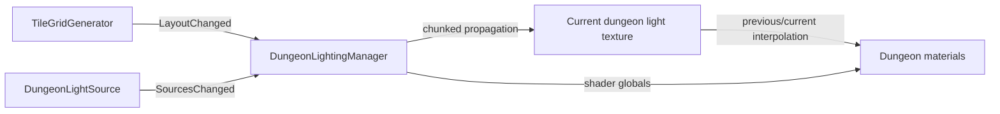

# Dungeon Lighting Architecture

## Purpose

`DungeonLightingManager` maintains a low-resolution world-space light field for dungeon materials. Lighting is a downstream consumer of dungeon topology rather than part of placement ownership.

## Inputs

- `TileGridGenerator` — grid dimensions, placed topology, material application, and `LayoutChanged`.
- `DungeonLightSource` — static/dynamic light sources and `SourcesChanged`.

## Runtime flow

The manager supports legacy cell sampling and smoother sub-cell sampling presets. Dynamic sources refresh on an interval rather than forcing a full per-frame rebuild.

Dynamic presentation uses two shared textures. Before a dynamic propagation
upload, the current target texture is copied to the previous texture. The new
field is uploaded to the current texture, and `_DungeonLightTextureBlend`
advances from 0 to 1 every rendered frame using unscaled time over the configured
dynamic update interval. Full/static rebuilds synchronize both textures
immediately. The default dynamic update interval is 0.05 seconds (20 Hz).

`RotationSafeTileAtlas.shader` samples `_DungeonLightTexture` with the manager's
grid-origin, grid-step, and grid-size globals. Before sampling, it snaps the
world-derived grid coordinate to `_DungeonLightingPixelsPerCell` blocks per
dungeon cell; the default is 2. This grid-space snapping is stable under camera
movement and tile rotation and is independent of the underlying LegacyCell,
Smooth2x, or Smooth4x propagation resolution.

The shader interpolates the previous/current local RGB fields, then combines
that local result with `_DungeonAmbientColor`, converts the total to Rec.709 luminance,
saturates it to the field's normalized 0-1 range, and quantizes that scalar using
`_LightSteps`. It remaps the quantized result through `_MinLight` to 1 and
multiplies the authored atlas rather than adding light color to it. The separate
phase-controlled `_GlobalLightIntensity` presentation multiplier is applied
afterward. The
`_DungeonLightingInitialized` global prevents an uninitialized/default texture
from lighting tiles before a manager has established its grid.

Ambient and local color have separate responsibilities. Ambient contributes to
brightness but not local hue. Local RGB is normalized by its maximum channel,
falling back to white when no local light is present, and blended from white by
the material's `_LightColorInfluence` (default 0.35). Overlapping colored sources
remain accumulated in the propagated RGB field, so their combined field color
produces the tint without a per-source shader loop. Tint and illumination remain
multiplicative, preserving near-black atlas detail.

The production tile receiver is visually unlit and has no main directional-light
or realtime main-light-shadow dependency. Normal data is used for rotation-safe
surface-role selection only, not diffuse lighting. Dungeon Sim therefore does
not rely on a sun/directional light for normal dungeon rendering.

The production `Placeholder_NPC` carries a dynamic `DungeonLightSource`, so its
light field contribution follows traversal automatically and refreshes at the
manager's configured dynamic interval.

## Phase presentation modes

`GameplayLoopController` selects the lighting presentation through
`DungeonLightingManager.SetPresentationMode` whenever the dungeon phase changes:

- `ExpansionUniform` uses uniform material illumination. It bypasses both the
  quantized dungeon light response and the propagated dungeon light texture so
  construction remains clearly readable.
- `ExploringAtmospheric` enables ambient dungeon darkness and quantized
  propagated static/dynamic sources such as NPC lights.

The manager blends `_DungeonLightingModeBlend` between these responses using
unscaled time. The default transition duration is 0.3 seconds, so pausing the
game does not strand the presentation between modes. Disabling or unloading the
manager resets the global to the uniform expansion response.

This blend is independent of `_GlobalLightIntensity`. The presentation mode
chooses which lighting model is visible; `DungeonVisualLightingController`
controls the separate phase-brightness treatment.

The runtime debug lighting override controls both layers. Enabling it uses the
configured debug brightness and forces the uniform presentation response,
bypassing quantized propagated dungeon cell/NPC lighting. Disabling it blends
back to the response for the current gameplay phase.

Current `DungeonLightSource` illumination is transported through the propagated
light field; it does not use Unity point/spot lights and does not cast realtime
Unity shadows. The shader retains its `ShadowCaster` pass for future
compatibility, but realtime stylized point/spot-light shadow reception requires
a separate implementation.

## Independent tuning controls

- Propagation resolution (`LightQualityPreset`) controls samples calculated per
  dungeon cell.
- Dynamic update interval controls how often moving sources are propagated.
- Visible lighting pixels per cell controls only the world-space block size used
  for shader sampling.
- `_LightSteps` controls the number of brightness bands.
- `_LightColorInfluence` controls restrained continuous local hue independently
  from quantized brightness.

## Ownership rule

Do not add light-state persistence to individual tile placements unless the light is itself authoritative gameplay content. The light field is derived from the current layout and active sources and should be rebuilt when those inputs change.

## When a generation change affects lighting

Check lighting if you change:

- what constitutes an open/closed connection;
- grid dimensions or coordinate mapping;
- material assignment for placed tiles;
- how layout-change events are emitted;
- topology that should block or transmit light.

## Extension guidance

- New lamp/torch content: prefer `DungeonLightSource` configuration/component work.
- New material response: shader / `DungeonLightReceiver` or material-side work.
- New propagation rule: `DungeonLightingManager` architecture work.
- Purely decorative emissive art that does not illuminate the dungeon does not need to enter this system.

## Related docs

- [`Dungeon_Generation.md`](Dungeon_Generation.md)
- [`System_Map.md`](System_Map.md)
- [`../Design/Visual_and_Interaction_Design.md`](../Design/Visual_and_Interaction_Design.md)
