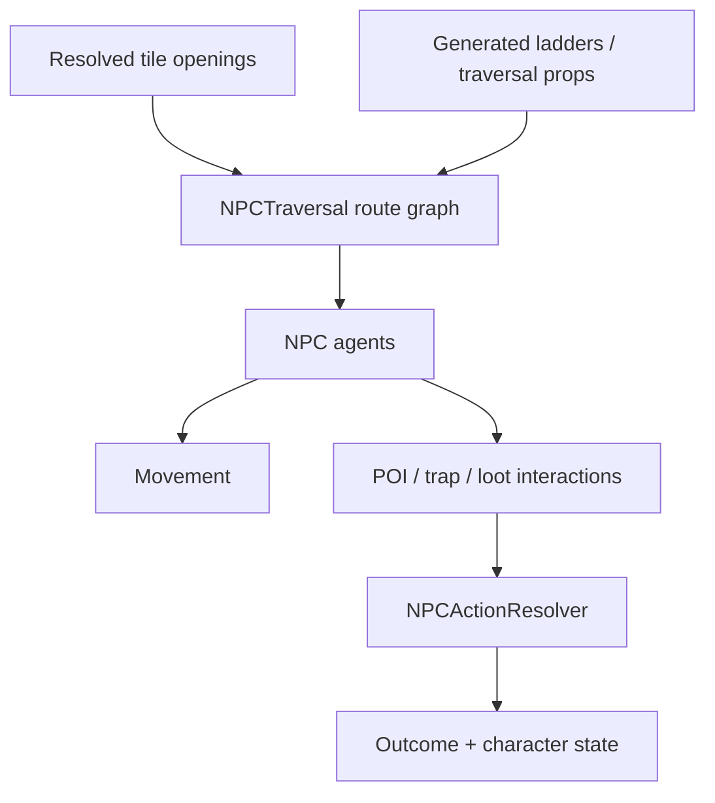

# NPC Runtime Architecture

## Purpose

`NPCTraversal` builds and consumes the runtime navigation model used by adventurers. It is downstream from the built dungeon topology and generated traversal structures.

## Primary inputs

- `TileGridGenerator` — placed cells and resolved horizontal openings.
- `PropGenerator` — generated ladders / traversal structures and their occupancy.
- `GameplayLoopController` — adventurer-run lifecycle.

## Primary collaborators

- `NPCCharacter` — adventurer state.
- `NPCActionResolver` — resolves gameplay interactions such as traps/actions.
- `DungeonPointOfInterest` — discoverable/interactable targets bound to dungeon cells.
- loot components such as `RecoverableDungeonLoot`, `RecoverableLootWorldDrop`, and carried-loot presentation.

## Route construction

The route graph is reconstructed state. The authoritative inputs are the dungeon layout/openings and traversal structures.

## Important boundary

A visual tile replacement can be a navigation change if its resolved openings differ. A procedural-prop change can also be a navigation change when that prop is a ladder or other traversal connector.

Therefore, when changing tile sockets, connection resolution, ladders, platforms, or traversal prop generation, explicitly verify route rebuilding.

## Trap interaction

`CellTrap` defines a simple cell-bound trap contract and receives `OnNpcEntered(NPCCharacter npc)`. Concrete traps such as `SpikeWallTrap` own their local timing/effect configuration and delegate gameplay resolution to `NPCActionResolver`.

This keeps route traversal separate from the detailed combat/challenge rule of each trap.

## POI interaction

Content can expose one or more `DungeonPointOfInterest` components. For example, `FloorProp.Initialize` binds child POIs explicitly because floor props are not required to be parented under their host tile prefab.

Prefer POIs and focused interaction components over adding content-specific branching to `NPCTraversal` when possible.

## Shared raider abilities

`RaiderAbilities` is the controller-independent request boundary for the raid
prototype. Player input and future NPC drivers call the same movement, jump,
attack, interaction, and damage request methods. The component owns Rigidbody
movement, grounded transitions, attack overlap/range and cooldown checks, and it
publishes accepted and rejected `RaiderAbilityResult` events.

Health and death remain owned by `NPCCharacter`. Damage continues through
`NPCActionResolver`, so input and AI callers cannot apply separate damage rules.
On death, `RaiderAbilities` clears only its requested locomotion input and stops
applying controlled movement. It preserves `Rigidbody.linearVelocity`, exposes it
through `CurrentVelocity`, and raises `Died` as the handoff point for a later
ragdoll or corpse-physics owner.
World content implements `IRaiderInteractable` to own interaction and objective
validity; `RaiderAbilities` only finds an in-range target and requests resolution.
The fixed Warrior input mapping and concrete treasure/escape objective adapters
belong to their later prototype tickets.

## Safe extension points

- New NPC presentation: `NPCCharacter` child/helper component.
- New action outcome: focused resolver/helper in the NPC action layer.
- New player or NPC raid driver: submit requests to `RaiderAbilities` rather than
  applying movement, damage, or objective state directly.
- New POI content: `DungeonPointOfInterest` plus a content component.
- New cell trap: subclass `CellTrap`.
- New traversal connector: requires route-graph integration and should be treated as architecture-level work.

## Verification checklist

When changing NPC runtime behavior:

1. Test a simple straight corridor.
2. Test a junction with multiple route options.
3. Test a ladder/traversal connection.
4. Test a topology edit followed by a fresh exploration run.
5. Test trap/POI entry behavior.
6. Test death/escape and recoverable loot outcomes if touched.
7. Save/load from a valid save phase if persistent NPC/loot state changed.

## Related docs

- [`Gameplay_Loop.md`](Gameplay_Loop.md)
- [`Dungeon_Generation.md`](Dungeon_Generation.md)
- [`Props_and_Traps.md`](Props_and_Traps.md)
- [`../HowTo/Modify_NPC_Behavior.md`](../HowTo/Modify_NPC_Behavior.md)
- [`../Design/NPC_Behavior.md`](../Design/NPC_Behavior.md)
- [`../Design/Capability_Gated_Traversal.md`](../Design/Capability_Gated_Traversal.md)
