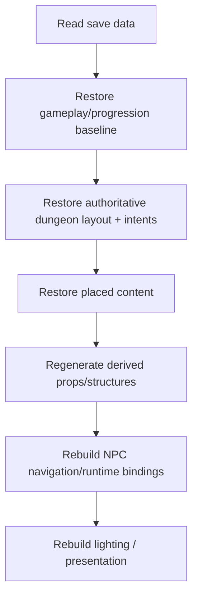

# Save System Architecture

## Purpose

`GameSaveManager` coordinates persistence across the major runtime systems. It is a cross-cutting integration point, not the owner of every piece of gameplay state.

## Current participants

- `GameplayLoopController`
- `TileGridGenerator`
- `TilePlacement`
- `NPCTraversal`

The save path currently captures state including gameplay progression, generation seed, adventurers, tile layout, connection intent, traps, floor props, recoverable loot, entrance state, recovered loot, Dread spending, and related histories.

## Save eligibility

Saving is intentionally constrained to a safe gameplay state. Current logic requires the dungeon to be initialized and the game to be in the `Expansion` phase.

That rule prevents persistence from freezing a transient exploration state whose route graph, animations, encounters, or topology-sensitive runtime state may be mid-update.

## Persistence model

Prefer this split:

**Save authoritative state**
- player choices;
- stable IDs and logical ownership;
- progression/economy values;
- placed content;
- generation seed or parameters required to reproduce generated content.

**Rebuild derived state**
- instantiated tile visuals when reproducible from layout/profile data;
- generated procedural props;
- NPC route graph;
- lighting field;
- debug/editor visualization.

## Adding a persistent feature

When a feature must survive save/load:

1. Decide which system owns the authoritative state.
2. Add stable serialized save data for that state.
3. Capture it through the owning system or a narrow accessor.
4. Restore authoritative topology/content before rebuilding downstream derived systems.
5. Rebind runtime-only references after restore.
6. Verify an old or missing field has a safe default when backwards compatibility matters.

Avoid making `GameSaveManager` reach deeply into private feature internals if the owning subsystem can expose a purpose-built capture/restore API.

## Restore ordering

A safe conceptual ordering is:

Exact implementation details may differ, but dependencies should flow from authoritative state toward reconstructed systems.

## High-risk mistakes

- Saving world position instead of stable cell/socket identity for topology-owned content.
- Saving generated instances as the only record of a structure.
- Restoring NPC traversal before the dungeon layout is valid.
- Adding a new placeable type without adding capture/restore coverage.
- Renaming IDs/prefabs used as persistence keys without migration/default handling.

## Manual verification

For persistent feature work:

1. Place/configure the feature.
2. Save during `Expansion`.
3. Change the scene/runtime state so a false positive is obvious.
4. Load.
5. Verify logical placement, orientation/state, generated dependents, navigation, and UI.
6. Run one exploration cycle after load.
7. Save/load again to catch one-time initialization errors.

## Related docs

- [`System_Map.md`](System_Map.md)
- [`Dungeon_Generation.md`](Dungeon_Generation.md)
- [`Gameplay_Loop.md`](Gameplay_Loop.md)
- [`NPC_Runtime.md`](NPC_Runtime.md)
