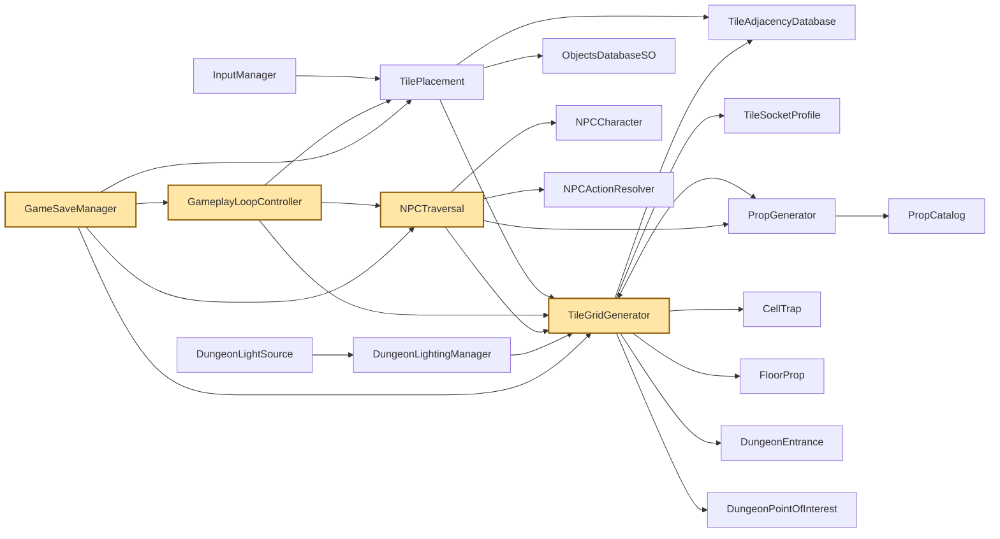
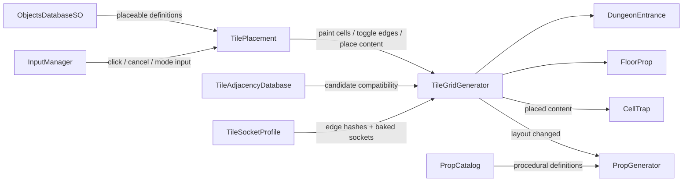
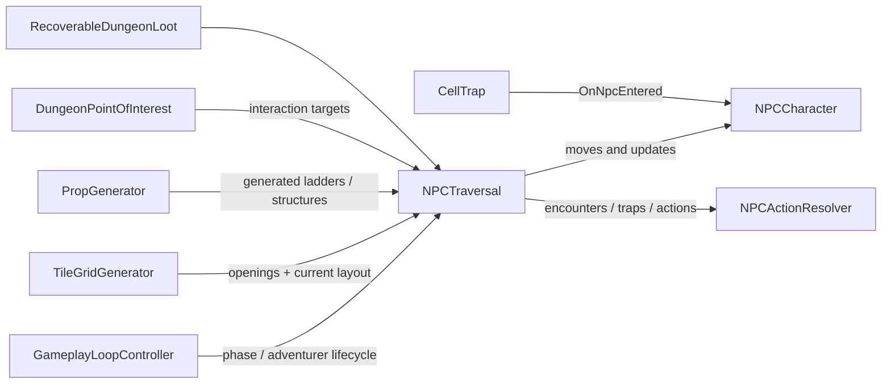
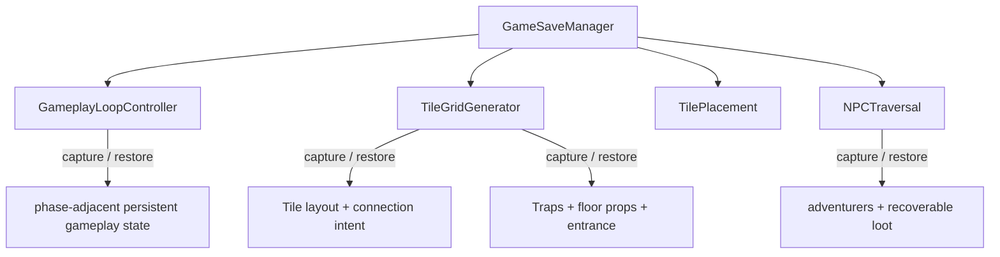
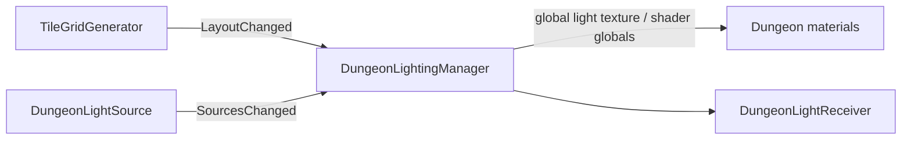

# System Map

This page is the fastest way to answer **“what else does this script touch?”** before making a manual change.

The arrows below show architectural dependency or data flow, not necessarily direct field references in every case.

## Whole-project overview

## Dungeon building and generation

### Key ownership rule

`TileGridGenerator` owns the authoritative built-cell layout and placement validation context. Tile art/profile selection is a resolved representation of that state, not the only source of truth.

## NPC runtime

NPC navigation is therefore downstream from both resolved tile openings and generated traversal structures. A change that modifies either may require route-graph rebuild behavior to remain correct.

## Persistence

When adding persistent gameplay content, check `GameSaveManager` before assuming a prefab or component will automatically survive load.

## Lighting

The lighting manager listens to layout changes and maintains its own chunked light field. Avoid adding lighting state directly to tile-placement logic unless the placement system genuinely owns that state.

## Dependency strength legend

- **Direct coordinator dependency:** serialized/component reference or explicit call path.
- **Event dependency:** a subsystem reacts to an event such as `LayoutChanged` or `SourcesChanged`.
- **Data dependency:** a ScriptableObject or profile supplies authored configuration.
- **Reconstruction dependency:** one runtime system rebuilds derived state from another authoritative system.

For exact code-level details, use [`../Reference/Script_Index.md`](../Reference/Script_Index.md) together with IDE “Find References”.
